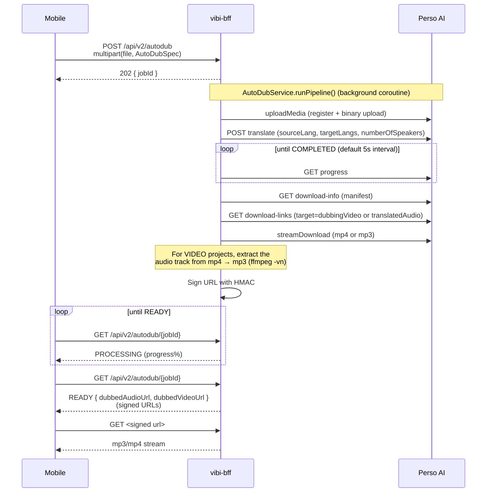
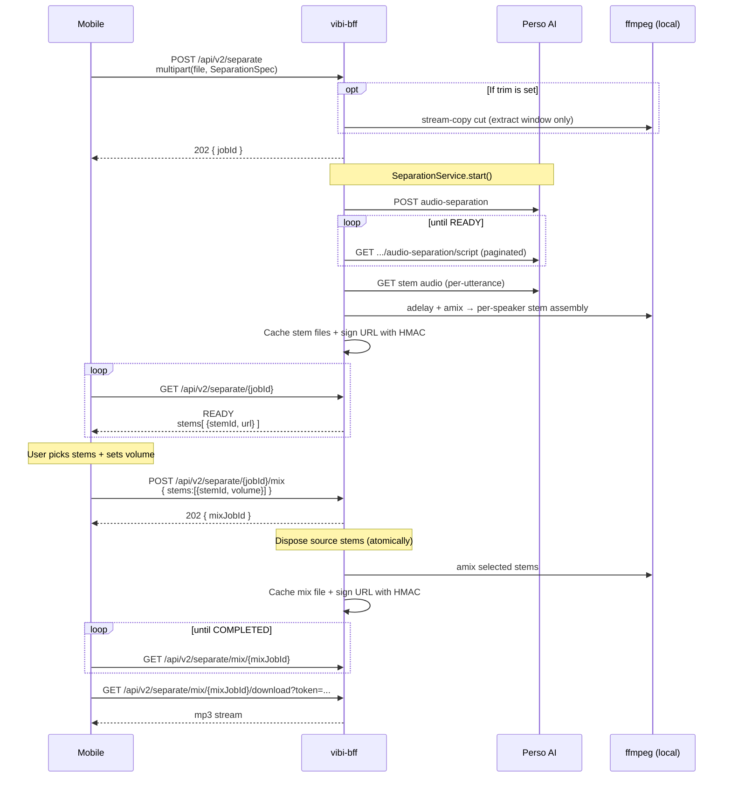

# Pipelines — Auto Dubbing and Stem Separation

vibi's two core jobs — **auto dubbing** and **stem separation** — are not simple single calls. Two external APIs (Perso, Gemini), polling, ffmpeg post-processing, and signed downloads line up in sequence. This article unfolds that sequence and explains *why this order* and *why the BFF took those steps*.

Premise: assumes the BFF-as-one-layer decision in [`why-bff.md`](./why-bff.md) is accepted.

---

## Auto Dubbing

### Flow at a glance

### Why each step

**Why immediate response + polling**
A Perso dubbing job takes 0.5–2x the video length. If you wait synchronously, mobile has to hold the connection open the entire time, which is fragile under backgrounding, cellular switching, and iOS background suspend. Cutting the job so that the client gets `jobId` immediately and polls later is safe no matter when it returns.

**Why a single Perso translate call**
vibi-bff does not do its own STT or speech synthesis — for dubbing, everything (translation + speech synthesis) is bundled into a single `submitTranslate` call to Perso as a black box. Because the translator and the voice model live inside the same vendor, voice consistency is preserved and the external call count is 1. (Gemini is only used for translation in the auto *captions* flow and for the chat router.)

**Why 5s polling**
The default for `PERSO_POLL_INTERVAL_MS`. Too short hits Perso-side rate limits; too long accumulates user-perceived latency. 5s is the sweet spot for vibi's video length range (10–60s) — usually only 1–2 more polls finish the job.

**Why extract audio separately from mp4**
For VIDEO projects, Perso returns `dubbingVideo` (mp4) directly, so the BFF does no muxing of its own. But mobile sometimes wants to preview audio only, so an audio-only endpoint for the same job is needed — the BFF uses `ffmpeg -vn` to drop just the audio track as mp3 alongside it. AUDIO projects skip this step and use Perso's `translatedAudio` as-is.

**Why the BFF re-caches the result**
Perso's download links are ephemeral, and some require Perso auth headers on relative paths (`/perso-storage/...`). The BFF fetches once, stores locally, and re-signs with its own HMAC token before handing it to mobile. When mobile's URL expires it just calls the same `getStatus` to get a fresh URL — mobile never directly depends on the external API's token lifetime.

### Code references

- Route: `vibi-bff/src/main/kotlin/com/vibi/bff/routes/AutoDubRoutes.kt`
- Service: `vibi-bff/.../service/AutoDubService.kt`
- Perso wrapper: `vibi-bff/.../service/PersoClient.kt`
- Client: `vibi-mobile/shared/.../api/BffApi.kt#submitAutoDubJob` · `getAutoDubStatus`

---

## Stem Separation + Remix

A similar job flow to auto dubbing, but **a user selection step is inserted in the middle** — the Perso-separated stems are shown to the user, the user chooses which stems to mix at which volume, and that decision is then mixed by ffmpeg.

### Flow at a glance

### Why each step

**Why the BFF trims with ffmpeg**
When `SeparationSpec` has both optional `trimStartMs`/`trimEndMs`, the BFF stream-copies just that window and sends it to Perso. Two reasons:
1. **Billing** — Perso bills by the length it processes. If the user already chose "just this slice," sending the entire video is wasted spend.
2. **Speed** — Processing time scales with window length. To separate just 5s out of a 60s video, you only wait the 5s worth, not 60s.

Validation (`partial_trim_range`, `trim_range_too_short`, etc.) also lives on the BFF side. The client does not need to duplicate validation — it can branch on the machine codes in [`../reference/error-contract.md`](../reference/error-contract.md).

**Why the user selection is inserted in the middle (jobId + mixJobId, two steps, not one-shot)**
vibi's core value is "operate at the stem level" — keeping only speaker 1, dropping the background and keeping voice only, and similar operations are decided *after* the user has actually heard the stems. Showing the separation result first, then receiving the user's decision and mixing, is the natural fit for two steps.

In exchange, the separation result has to live somewhere. The BFF caches the stem files keyed by jobId, and when the mix call arrives it runs ffmpeg amix.

**Why the mix disposes the source stems**
When the mix job starts, the BFF atomically discards that jobId's stems. Calling mix again with the same jobId returns `409 Conflict`. Reasons:
- Disk savings — stems take up the video length's worth of mp3/wav each
- Simpler user flow — one separation = one mix result. If multiple mix variants from the same separation are needed, redo the separation itself.

A separation that stays `READY` for a long time without a mix is cleaned up by a reaper after `SEPARATION_ABANDON_TTL_MS` (default 30 minutes).

**Why HMAC-signed URLs instead of static mounts for stems · mixes**
User voice and background stems are often sensitive data. With a static mount, anyone with the URL can fetch them. HMAC signing + short TTL (`SEPARATION_URL_TTL_SEC` default 30 minutes) blocks accidental exposure. Rotating `SEPARATION_SIGNING_SECRET` once invalidates every unexpired token.

### Code references

- Route: `vibi-bff/.../routes/SeparationRoutes.kt`
- Service: `SeparationService.kt`, `StemMixService.kt`
- Signing: `SignedUrlService.kt`
- Client: `BffApi.kt#startSeparation` · `getSeparationStatus` · `requestStemMix` · `getMixStatus`

---

## Shared pattern

Both flows follow the same skeleton:

1. **client → BFF**: multipart upload + spec → immediate `jobId` response
2. **BFF → external API**: upload → start job → poll → download
3. **BFF → local**: cache result + ffmpeg post-process + HMAC sign
4. **client ← BFF**: poll jobId → signed URL → bytes

This skeleton is reused as-is in vibi's other jobs (`/api/v2/subtitles`, `/api/v2/render`) — the same `JobResponse` / `StatusResponse` shape, the same polling pattern, the same signing scheme.

To add a new job, the fastest path is to fork an existing service/route pair.

---

## See also

- Walk through the client-side of the flow once: [`../learning/tutorial-auto-dub.md`](../learning/tutorial-auto-dub.md)
- Exact per-route spec: [`../reference/bff-api.md`](../reference/bff-api.md)
- The larger picture of the BFF layer: [`why-bff.md`](./why-bff.md)
- Code-grounded facts: [`../../ARCHITECTURE.md`](../../ARCHITECTURE.md) § 3
