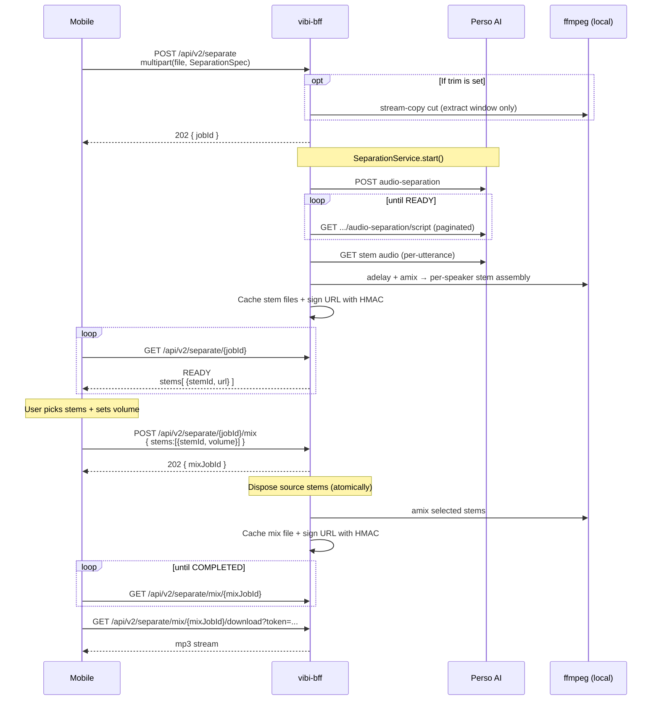
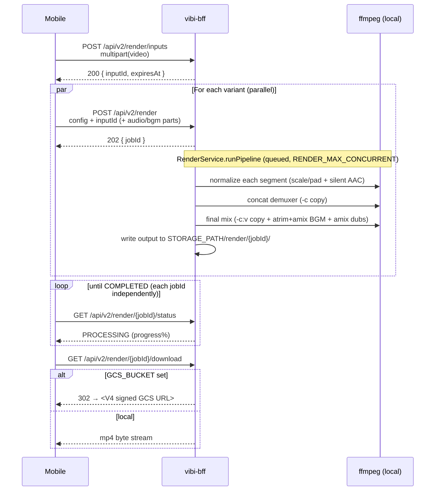

# Pipelines — Stem Separation and Multi-variant Render

vibi's two core jobs — **stem separation** and **multi-variant video render** — are not simple single calls. An external API (Perso), polling, ffmpeg post-processing, and signed downloads line up in sequence. This article unfolds that sequence and explains *why this order* and *why the BFF took those steps*.

Premise: assumes the BFF-as-one-layer decision in [`why-bff.md`](./why-bff.md) is accepted.

> Auto dubbing / auto subtitles / lipsync used to be part of this article. Both flows were removed from the BFF surface in commit `52f8d7c` (`sticker/자막/더빙 surface 절단`). The flow that replaced them in practice — exporting N localized variants from a single edit — is documented under **Multi-variant Render** below.

---

## Stem Separation + Remix

A similar job flow to auto dubbing, but **a user selection step is inserted in the middle** — the Perso-separated stems are shown to the user, the user chooses which stems to mix at which volume, and that decision is then mixed by ffmpeg.

### Flow at a glance

### Why each step

**Why the BFF trims with ffmpeg**
When `SeparationSpec` has both optional `trimStartMs`/`trimEndMs`, the BFF stream-copies just that window and sends it to Perso. Two reasons:
1. **Billing** — Perso bills by the length it processes. If the user already chose "just this slice," sending the entire video is wasted spend.
2. **Speed** — Processing time scales with window length. To separate just 5s out of a 60s video, you only wait the 5s worth, not 60s.

Validation (`partial_trim_range`, `trim_range_too_short`, etc.) also lives on the BFF side. The client does not need to duplicate validation — it can branch on the machine codes in [`../reference/error-contract.md`](../reference/error-contract.md).

**Why the user selection is inserted in the middle (jobId + mixJobId, two steps, not one-shot)**
vibi's core value is "operate at the stem level" — keeping only speaker 1, dropping the background and keeping voice only, and similar operations are decided *after* the user has actually heard the stems. Showing the separation result first, then receiving the user's decision and mixing, is the natural fit for two steps.

In exchange, the separation result has to live somewhere. The BFF caches the stem files keyed by jobId, and when the mix call arrives it runs ffmpeg amix.

**Why the mix disposes the source stems**
When the mix job starts, the BFF atomically discards that jobId's stems. Calling mix again with the same jobId returns `409 Conflict`. Reasons:
- Disk savings — stems take up the video length's worth of mp3/wav each
- Simpler user flow — one separation = one mix result. If multiple mix variants from the same separation are needed, redo the separation itself.

A separation that stays `READY` for a long time without a mix is cleaned up by a reaper after `SEPARATION_ABANDON_TTL_MS` (default 7 days — sized to match the mobile-side "resume later" window so an unfinished session still has live stem tokens when the user comes back).

**Why HMAC-signed URLs instead of static mounts for stems · mixes**
User voice and background stems are often sensitive data. With a static mount, anyone with the URL can fetch them. HMAC signing + a TTL bound to the abandon window (`SEPARATION_URL_TTL_SEC` default 7 days, never longer than `SEPARATION_ABANDON_TTL_MS`) blocks accidental exposure. Rotating `SEPARATION_SIGNING_SECRET` once invalidates every unexpired token.

### Code references

- Route: `vibi-bff/.../routes/SeparationRoutes.kt`
- Service: `SeparationService.kt`, `StemMixService.kt`
- Signing: `SignedUrlService.kt`
- Client: `BffApi.kt#startSeparation` · `getSeparationStatus` · `requestStemMix` · `getMixStatus`

---

---

## Multi-variant Render

A single edit is often rendered N times — once per language the user wants the subtitle / dub variant for. Naively that's N multipart uploads of the source video; vibi optimizes it down to one.

### Flow at a glance

### Why each step

**Why the input cache (`/render/inputs`)**
A 30s edited video can easily be 30–50MB. Re-uploading it N times to render N localized variants wastes both client bandwidth and BFF receive time, especially on cellular. The input cache uses `sha256(video)[:16]` as the slot key, so retries are idempotent and a re-uploaded identical file resolves to the same slot.

The mobile use-case (`SaveAllVariantsUseCase`) decides whether to pre-upload based on a variant count: 2+ render variants → upload first, 1 variant → just multipart the bytes into `/render` directly. The throughput win only materializes at multi-variant.

**Why parallel renders capped by `RENDER_MAX_CONCURRENT`**
With the input cached, the BFF can fan out renders without back-pressure on uploads. Each variant differs only in dubs / BGM / subtitle burn-in choice, so wall-clock scales with the slowest variant rather than the sum. The cap (`RENDER_MAX_CONCURRENT`, default `CPU/2`) prevents ffmpeg processes from saturating the host — important on Cloud Run where vCPU is allocated.

**Why `-c:v copy` in the final mix pass**
The per-segment normalize step already produces output-resolution H.264. The final mix pass only changes audio (BGM `atrim`+`amix`, dub `adelay`+`amix`, optional audio_override). Re-encoding video here would burn 95% of the CPU for nothing — `-c:v copy` keeps it at ~5%. Commit `6bcb392` records the perf delta.

**Why BGM `atrim` lives on the BFF**
The mobile `BgmTrimSheet` lets a user drag handles to pick a sub-range of a long BGM track (e.g. 10s out of a 3-min song). vibi could re-encode the BGM file mobile-side before upload, but that pushes the cost onto the device and duplicates ffmpeg logic. Instead the trim window (`sourceTrimStartMs`/`sourceTrimEndMs`) rides along in the render config and the BFF applies `atrim`+`asetpts` at mix time — single source of truth, no duplicated ffmpeg.

**Why download stays a separate hop**
`POST /render` returning the rendered bytes inline would make polling state-dependent ("did I already drain the body?") and reject reconnect-on-flaky-cellular. Splitting into `submit → poll → download` keeps each request independent and resumable. The download itself either streams from BFF (`respondFile`) or 302s to GCS — see the next section.

### Code references

- Route: `vibi-bff/src/main/kotlin/com/vibi/bff/routes/RenderRoutes.kt`
- Service: `RenderService.kt`, `RenderInputCacheService.kt`, `FfmpegRunner.kt`
- Mobile orchestrator: `vibi-mobile/shared/.../usecase/save/SaveAllVariantsUseCase.kt`
- Client: `BffApi.kt#uploadRenderInputs` · `submitRenderJob` · `getRenderStatus`

---

## Shared pattern

Both flows follow the same skeleton:

1. **client → BFF**: multipart upload + spec → immediate `jobId` response
2. **BFF → external API or local ffmpeg**: prepare → start job → poll → produce artifact
3. **BFF → local**: cache result + HMAC sign (or skip signing for the publicly-readable render output)
4. **client ← BFF**: poll jobId → signed URL → bytes (or **302 redirect to GCS V4 signed URL**, see below)

The same `JobResponse` / `StatusResponse` shape, the same polling pattern, the same `respondDownload` helper sit underneath both routes. To add a new job, the fastest path is to fork an existing service/route pair.

### Download responder — file streaming vs. GCS redirect

The download endpoints (`/render/{id}/download`, `/separate/{id}/stem/{stemId}`, `/separate/mix/{id}/download`) all funnel through a single `respondDownload` helper. It picks one of two paths at request time:

- **`GCS_BUCKET` set** (production Cloud Run) — the file is uploaded to GCS idempotently, and the BFF returns `302 Location: <V4 signed URL>` with a short TTL (`GCS_SIGNED_URL_TTL_SEC`, default 15 min). The Cloud Run instance stops as soon as the redirect is written, so its CPU/memory and outbound egress aren't tied up by the byte stream. Cloud Run's per-instance concurrency cap (set to 4 for the BFF) is freed back to handle the next request.
- **`GCS_BUCKET` blank** (local dev) — the same route falls back to `respondFile` streaming. No GCS dependency, no signing roundtrip.

The HMAC signing layer on top of this is unchanged — the BFF still verifies its own token (where applicable — separation stems / mixes) before the redirect/stream, so the upstream auth model didn't move. What moved is *who sends the bytes to the client*: BFF in dev, GCS in production.

### Render quality profile

The `/api/v2/render` config carries an optional `quality` enum (`low` / `medium` / `high`, default `medium`) that maps to an `(x264 CRF, preset, audio bitrate)` triple:

| Profile | CRF | preset | audio |
|---|---|---|---|
| `high` | 20 | medium | 192k |
| `medium` | 23 | fast | 192k |
| `low` | 28 | fast | 128k |

CRF is the dominant lever — one CRF point is roughly one perceptual step, while one preset step is under 0.5 dB SSIM. Tying preset to profile keeps the two knobs on a single axis so the client doesn't have to think about them independently. Since the final mix pass uses `-c:v copy`, the CRF only kicks in during the per-segment normalize step.

---

## See also

- Walk through the client-side of separation: [`../learning/tutorial-stem-separation.md`](../learning/tutorial-stem-separation.md)
- Walk through the client-side of multi-variant render: [`../learning/tutorial-export-variants.md`](../learning/tutorial-export-variants.md)
- Exact per-route spec: [`../reference/bff-api.md`](../reference/bff-api.md)
- The larger picture of the BFF layer: [`why-bff.md`](./why-bff.md)
- Code-grounded facts: [`../../ARCHITECTURE.md`](../../ARCHITECTURE.md) § 3
