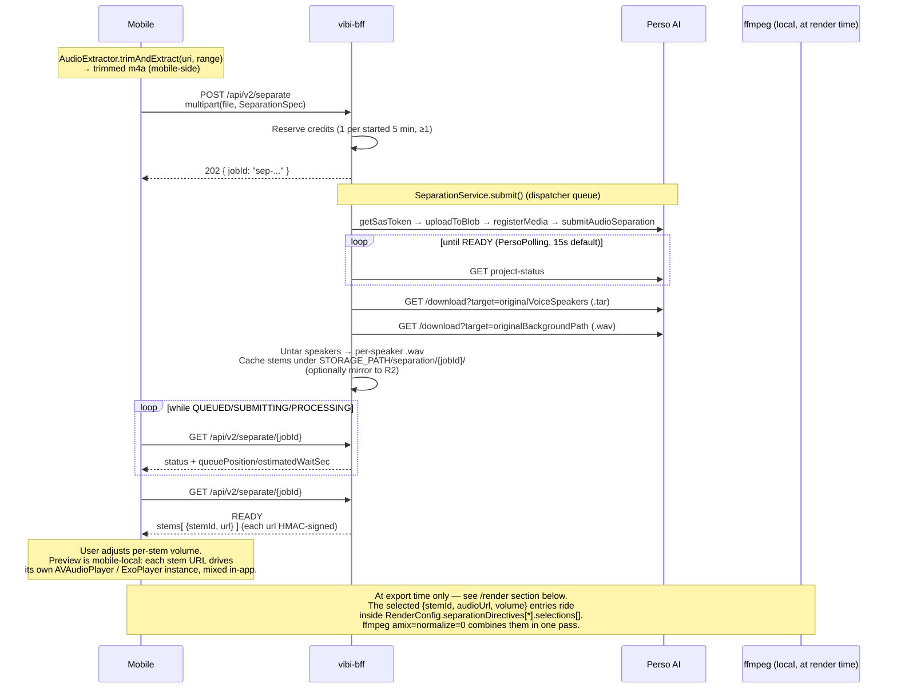
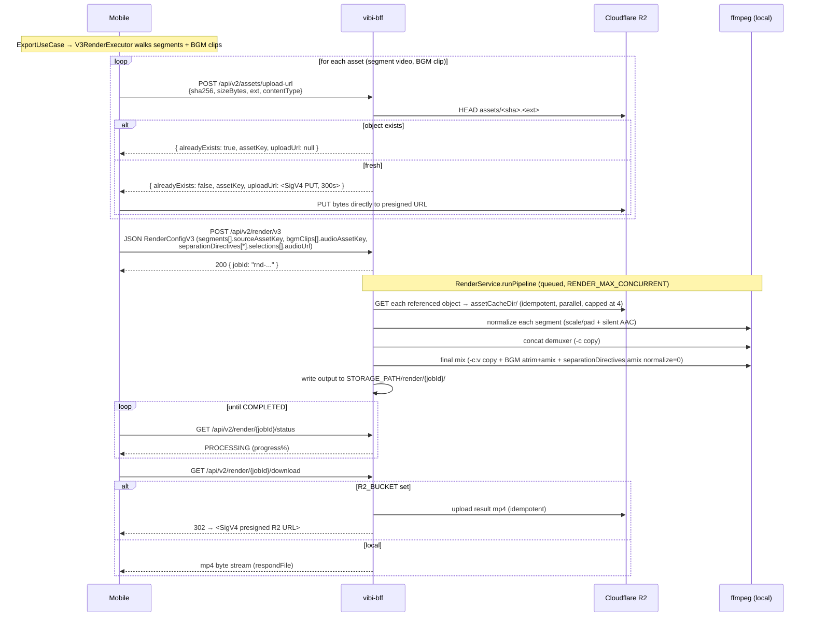

# Pipelines — Stem Separation and Asset-by-Reference Render

vibi's two core jobs — **stem separation** and **video render** — are not simple single calls. An external API (Perso), polling, ffmpeg post-processing, and signed downloads line up in sequence. This article unfolds that sequence and explains *why this order* and *why the BFF took those steps*.

Premise: assumes the BFF-as-one-layer decision in [`why-bff.md`](./why-bff.md) is accepted.

> Auto dubbing / auto subtitles / lipsync used to be part of this article. All three flows were removed from the BFF surface in commit `52f8d7c` (`sticker/자막/더빙 surface 절단`). The earlier server-side mix endpoint (`POST /api/v2/separate/{id}/mix`) was also retired once the mobile-local preview proved sufficient — the final mix now happens inside `/render`. The multi-variant export UI is gone; export is a single mp4.

---

## Stem Separation + Remix

The Perso-separated stems are shown to the user, the user adjusts which stems to mix at which volume *on the mobile side* (multi-player preview), and the final committed mix is folded into the render pass at export time.

### Flow at a glance

### Why each step

**Why trim runs on the mobile side, not the BFF**
The mobile client already has the source video on disk; iOS `AVAssetExportPresetAppleM4A` (or Android equivalent) can extract a trimmed m4a faster than a 50 MB round-trip to the BFF and back. Perso bills by the length it processes, so the BFF receives only the trimmed window and forwards it as-is — no ffmpeg step before Perso. The BFF rejects anything outside `{m4a, mp3, wav}` with `400 unsupported_audio_format` (Perso silently drops FLAC even though earlier upload steps succeed — see `vibi-bff/CLAUDE.md` "Known BFF bug patterns").

**Why mobile-local preview instead of a server-side mix job**
The earlier design exposed `POST /api/v2/separate/{jobId}/mix` so the BFF could amix the user's selection and return one mp3. That cost a round-trip per slider movement and forced the BFF to hold a `mixJobId` lifecycle on top of `jobId`. Once mobile gained the ability to spin up one player per stem and adjust volumes in real time, the server-side mix endpoint became dead weight and was removed. The *final committed* mix still has to be deterministic for export — but that's the next bullet.

**Why the final mix is folded into `/render`, not a separate endpoint**
At export time `RenderConfig.separationDirectives[*].selections[]` carries each stem's signed URL and final volume. ffmpeg `amix=normalize=0` combines them in the same pass that produces the output mp4 — no extra hop. `normalize=0` is required so unmuting every stem reproduces the original loudness (the ffmpeg default `normalize=1` auto-attenuates by input count, which made fully-unmuted output noticeably quieter — fix in commit `92e1758`). The BFF rejects any `audioUrl` that isn't its own HMAC-signed `/separate/.../stem/` URL with `400 invalid_stem_url`.

**Why HMAC-signed URLs instead of static mounts for stems**
User voice and background stems are often sensitive data. With a static mount, anyone with the URL can fetch them. HMAC signing + a TTL bound to the abandon window (`SEPARATION_URL_TTL_SEC` default 7 days, never longer than `SEPARATION_ABANDON_TTL_MS`) blocks accidental exposure. Rotating `SEPARATION_SIGNING_SECRET` once invalidates every unexpired token.

**Why a separation that goes unmixed is reaped**
A separation that stays `READY` for a long time without ever feeding a render is cleaned up by a reaper after `SEPARATION_ABANDON_TTL_MS` (default 7 days — sized to match the mobile-side "resume later" window so an unfinished session still has live stem tokens when the user comes back). The stuck-SUBMITTING reaper (`SEPARATION_STUCK_SUBMITTING_SEC`, default 10 minutes) covers the other failure mode: a worker that died mid-upload would otherwise leave a job stuck forever.

### Code references

- Route: `vibi-bff/.../routes/SeparationRoutes.kt`
- Service: `SeparationService.kt`, `SeparationDispatcher.kt` (queue), `PersoClient.kt`
- Signing: `SignedUrlService.kt`
- Client: `BffApi.kt#startSeparation` · `getSeparationStatus`
- Mobile mixer: `vibi-mobile/cmp/.../platform/StemMixer.{android,ios}.kt`

---

---

## Render (asset-by-reference)

A vibi project is exported as a single mp4. Naively each export multipart-uploads the source video bytes again; vibi cuts that out by addressing assets by SHA-256 against Cloudflare R2, so a re-export of the same source (different edit, same bytes) only travels the per-edit JSON config.

### Flow at a glance

### Why each step

**Why upload-by-SHA via R2 instead of multipart `/render`**
A 30s edited video is easily 30–50 MB; an edit-then-re-export cycle on the same source would multipart that whole payload again under the legacy path. R2 charges nothing for egress and dedup-by-key is a single HEAD round-trip, so once the source is in R2 every subsequent export is "just the render config JSON over the wire." `/render/v3` requires only the asset keys, never the bytes. The legacy multipart `POST /render` (and `POST /render/inputs` for re-using one upload across many jobs) is retained as a fallback when R2 isn't configured (`r2_disabled` → mobile falls back to `submitRenderJob`).

**Why a separate `POST /assets/upload-url`**
SigV4 binds `contentType` and `Content-Length` at sign time — the subsequent PUT must use the exact same values or R2 returns 401. Letting the BFF issue the presigned URL keeps SigV4 secrets out of the mobile bundle, and the BFF can dedup against R2 first (`alreadyExists=true` → no PUT). The presigned URL has a 300s TTL to keep the leak window tiny.

**Why `-c:v copy` in the final mix pass**
The per-segment normalize step already produces output-resolution H.264. The final mix pass only changes audio (BGM `atrim`+`amix`, separation `amix normalize=0`). Re-encoding video here would burn 95% of the CPU for nothing — `-c:v copy` keeps it at ~5%. Commit `6bcb392` records the perf delta.

**Why BGM `atrim` lives on the BFF**
The mobile `BgmTrimSheet` lets a user drag handles to pick a sub-range of a long BGM track (e.g. 10s out of a 3-min song). vibi could re-encode the BGM file mobile-side before upload, but that pushes the cost onto the device and duplicates ffmpeg logic. Instead the trim window (`sourceTrimStartMs`/`sourceTrimEndMs`) rides along in the render config and the BFF applies `atrim`+`asetpts` at mix time — single source of truth, no duplicated ffmpeg.

**Why concurrency capped by `RENDER_MAX_CONCURRENT`**
ffmpeg is CPU-bound. The cap (default `availableProcessors() / 2`) prevents a burst of concurrent renders from saturating the host — important on Cloud Run where vCPU is allocated. The asset download stage inside `/render/v3` has its own smaller semaphore (4) so a single render with many segments doesn't burst R2 connections.

**Why download stays a separate hop**
`POST /render` returning the rendered bytes inline would make polling state-dependent ("did I already drain the body?") and reject reconnect-on-flaky-cellular. Splitting into `submit → poll → download` keeps each request independent and resumable. The download itself either streams from BFF (`respondFile`) or 302s to R2 — see the next section.

### Code references

- Routes: `vibi-bff/src/main/kotlin/com/vibi/bff/routes/RenderRoutes.kt` (`POST /render`, `POST /render/inputs`, `POST /render/v3`), `AssetRoutes.kt`
- Service: `RenderService.kt`, `RenderInputCacheService.kt`, `ObjectStore.kt`, `FfmpegRunner.kt`
- Mobile orchestrator: `vibi-mobile/shared/.../usecase/save/SaveAllVariantsUseCase.kt`, `data/repository/V3RenderExecutor.kt`, `data/remote/AssetUploadManager.kt`
- Client: `BffApi.kt#requestAssetUploadUrl` · `putAssetToR2` · `submitRenderJobV3` · `getRenderStatus`

---

## Shared pattern

Both flows follow the same skeleton:

1. **client → BFF**: multipart upload + spec → immediate `jobId` response
2. **BFF → external API or local ffmpeg**: prepare → start job → poll → produce artifact
3. **BFF → local**: cache result + HMAC sign (or skip signing for the publicly-readable render output)
4. **client ← BFF**: poll jobId → signed URL → bytes (or **302 redirect to R2 SigV4 presigned URL**, see below)

The same `JobResponse` / `StatusResponse` shape, the same polling pattern, the same `respondDownload` helper sit underneath both routes. To add a new job, the fastest path is to fork an existing service/route pair.

### Download responder — file streaming vs. R2 redirect

The download endpoints (`/render/{id}/download`, `/separate/{id}/stem/{stemId}`) all funnel through a single `respondDownload` helper. It picks one of two paths at request time:

- **`R2_BUCKET` set** (production Cloud Run) — the file is uploaded to Cloudflare R2 idempotently, and the BFF returns `302 Location: <SigV4 presigned URL>` with a short TTL (`SIGNED_URL_TTL_SEC`, default 15 min). The Cloud Run instance stops as soon as the redirect is written, so its CPU/memory and outbound egress aren't tied up by the byte stream. Cloud Run's per-instance concurrency cap (set to 4 for the BFF) is freed back to handle the next request. **R2 egress is free**, so the redirect also drops the variable cost component to zero — a video-heavy app's largest operating-cost vector.
- **`R2_BUCKET` blank** (local dev) — the same route falls back to `respondFile` streaming. No object-store dependency, no signing roundtrip.

The HMAC signing layer on top of this is unchanged — the BFF still verifies its own token (where applicable — separation stems / mixes) before the redirect/stream, so the upstream auth model didn't move. What moved is *who sends the bytes to the client*: BFF in dev, R2 in production.

> **Historical note.** The BFF originally used GCS V4 signed URLs in this slot. It was migrated to R2 specifically because GCS egress (\$0.12/GB after 1 GB/month free) was projected to dominate operating cost at modest mobile-user scale. The S3-compatible API (`software.amazon.awssdk:s3` against the R2 endpoint) made the migration mostly a config swap. The shape of this section is unchanged — only the backend is.

### Render quality profile

The `/api/v2/render` config carries an optional `quality` enum (`low` / `medium` / `high`, default `medium`) that maps to an `(x264 CRF, preset, audio bitrate)` triple:

| Profile | CRF | preset | audio |
|---|---|---|---|
| `high` | 20 | medium | 192k |
| `medium` | 23 | fast | 192k |
| `low` | 28 | fast | 128k |

CRF is the dominant lever — one CRF point is roughly one perceptual step, while one preset step is under 0.5 dB SSIM. Tying preset to profile keeps the two knobs on a single axis so the client doesn't have to think about them independently. Since the final mix pass uses `-c:v copy`, the CRF only kicks in during the per-segment normalize step.

---

## See also

- Walk through the client-side of separation: [`../learning/tutorial-stem-separation.md`](../learning/tutorial-stem-separation.md)
- Walk through the client-side of the export pipeline: [`../learning/tutorial-export-variants.md`](../learning/tutorial-export-variants.md)
- Exact per-route spec: [`../reference/bff-api.md`](../reference/bff-api.md)
- The larger picture of the BFF layer: [`why-bff.md`](./why-bff.md)
- Code-grounded facts: [`../../ARCHITECTURE.md`](https://github.com/perso-devrel/vibi/blob/main/ARCHITECTURE.md) § 3
